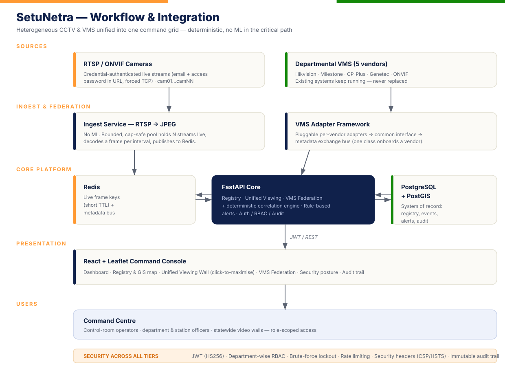
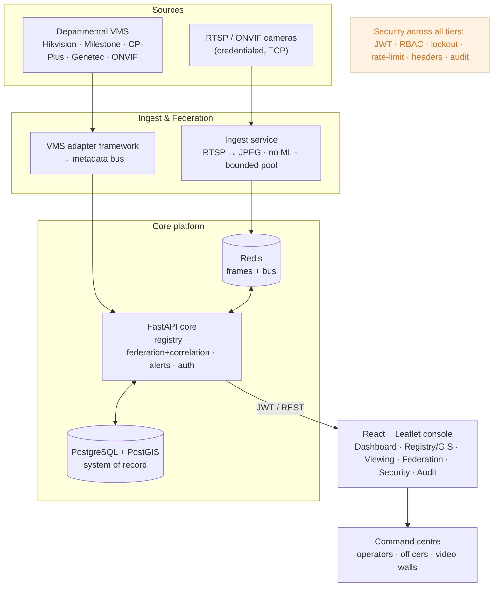
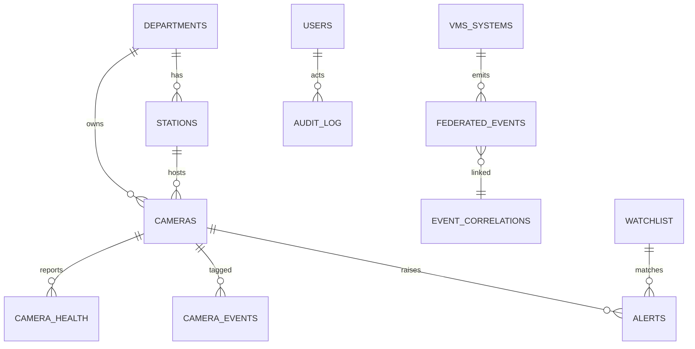
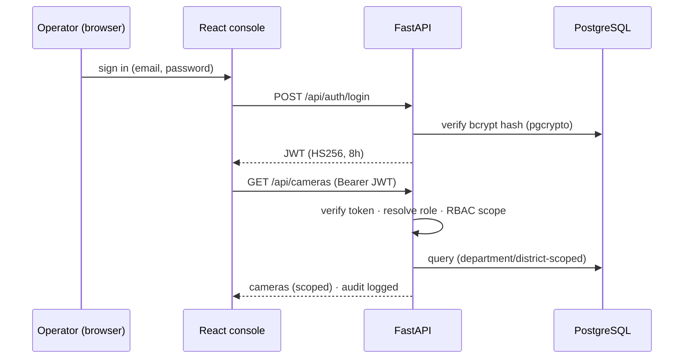
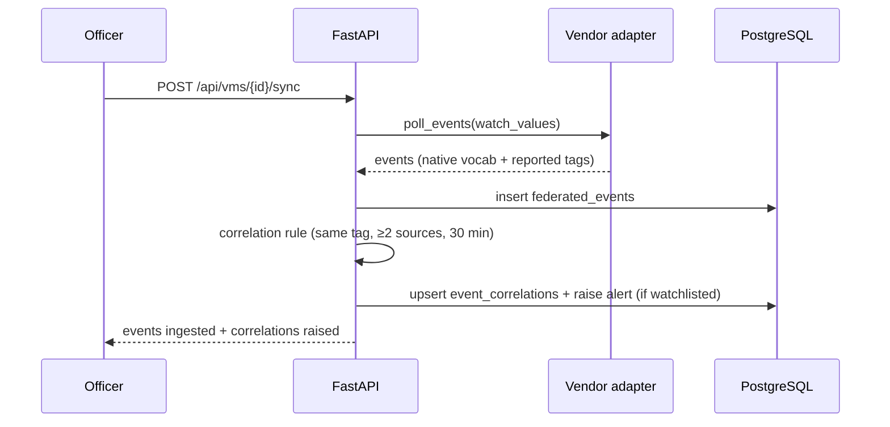
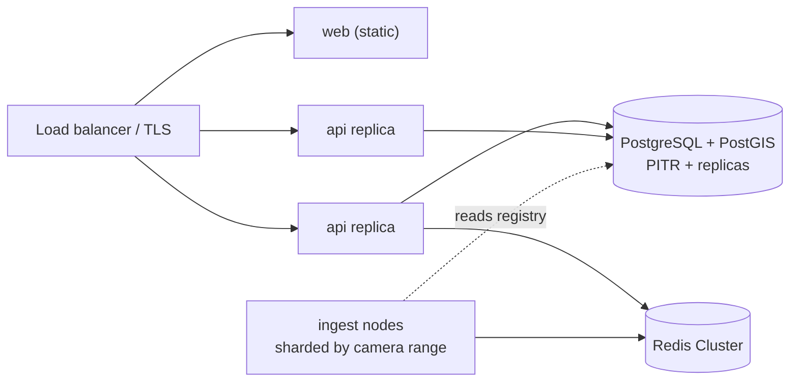

# SetuNetra — High-Level Design & Architecture

**Integrated Video Management & Analytics Platform**
Gujarat Police Innovation Challenge 2026 · Step-5 deliverable (HLD)

---

## 1. Purpose & scope

This document describes the high-level design of **SetuNetra** — a platform that
onboards, maps, views and federates the state's fragmented, multi-department CCTV
into a single command console **without replacing any existing VMS**. It implements
a hybrid of the challenge's **Model 1 (Registry & GIS)**, **Model 2 (Unified
Viewing)** and **Model 3 (VMS Federation)**, plus a cross-cutting cybersecurity
layer. All analytics are **deterministic and rule-based** — there is no ML in the
critical path, so the system is GPU-free, privacy-preserving and auditable.

## 2. Workflow & integration diagram

The same flow as a code-rendered graph:

## 3. Architecture overview

Four independent, horizontally scalable tiers communicating only through Redis and
PostgreSQL — services never import across the folder boundary.

| Tier | Component | Responsibility |
|---|---|---|
| **Ingest** | `ingest/live_ingest.py` | Decode each camera's RTSP to a periodic JPEG (no ML); write truthful health/status. Bounded, cap-safe concurrency. |
| **Core** | `api/` (FastAPI) | Registry, onboarding, unified-viewing endpoints, VMS federation + correlation engine, rule-based alerting, JWT auth / RBAC / audit. |
| **Bus / cache** | Redis | Live frame keys (short TTL) + metadata/event bus. |
| **Store** | PostgreSQL + PostGIS | System of record: cameras (geometry), health, gaps, watchlist, events, VMS, federated events, correlations, alerts, audit, security events. |
| **Presentation** | `web/` (React + Vite + Leaflet) | Command console — dashboard, GIS registry, viewing wall, federation, security, audit. |

## 4. Component design

### 4.1 Registry & GIS (Model 1)
- Onboarding by **bulk CSV / manual / API**, all through one validated, audited upsert.
- Cameras stored as **PostGIS points**; interactive Leaflet map with department/status layers.
- **Health monitoring** (`camera_health`) and **coverage-gap analysis** (`coverage_gaps`, geometric + department/district distribution).

### 4.2 Unified Viewing (Model 2)
- **Ingest** pulls live RTSP → JPEG into Redis; the console polls auth-gated snapshots.
- Viewing wall with **click-to-maximise** live view; **operator event tagging**; **searchable, camera-wise event index**; rule-based **alerts**.

### 4.3 VMS Federation (Model 3)
- **Adapter framework** (`api/app/adapters/`): one `@register("<type>")` class per vendor exposing `health / list_cameras / poll_events`.
- Adapters feed a **metadata bus** (`federated_events`); a **deterministic correlation engine** links the same entity reported by ≥2 sources within a time window (`event_correlations`), raising alerts on watchlist matches.

### 4.4 Cybersecurity (cross-cutting)
- Stateless **JWT (HS256)**; **bcrypt** passwords via `pgcrypto`; **department-scoped RBAC** enforced server-side.
- **Brute-force lockout**, per-IP **rate limiting**, **security headers** (CSP/HSTS/XFO), **immutable audit trail**, live **security posture** dashboard.

## 5. Data model (key entities)

Supporting tables: `security_events`, `external_lookups` (mock VAHAN/Sarthi shells),
`coverage_gaps` (PostGIS regions).

## 6. Request & authentication flow

## 7. Federation & correlation flow

## 8. Technology stack

| Layer | Technology |
|---|---|
| Frontend | React 18, Vite, react-leaflet, OpenStreetMap tiles (keyless) |
| Backend | Python 3.11, FastAPI, SQLAlchemy, GeoAlchemy2 |
| Ingest | OpenCV (FFmpeg backend) — decode only, **no ML** |
| Data | PostgreSQL 16 + PostGIS, Redis 7 |
| Auth | Stateless JWT (HS256), bcrypt via pgcrypto |
| Packaging | Docker, Docker Compose |

## 9. Deployment view

- **Stateless API replicas** behind a load balancer (TLS termination).
- **Ingest nodes** are regional and horizontally sharded by camera-id range.
- **PostgreSQL** with streaming replication + PITR; **Redis Cluster** for the bus.
- Target deployment is **on-premise** (government data residency); no public cloud dependency.

## 10. Non-functional requirements

| Attribute | Design response |
|---|---|
| **Scalability** | Stateless tiers; snapshot-first bandwidth; GPU-free linear CPU scaling → ~80,000 cameras. See `SCALABILITY.md`. |
| **Availability** | Stateless API replicas; DB PITR + standby; ephemeral Redis frames self-heal. |
| **Security** | Zero-trust: JWT, dept RBAC, lockout, rate limiting, headers, immutable audit. |
| **Performance** | Ingest is I/O-bound at snapshot cadence; API is standard web-tier capacity. |
| **Interoperability** | Vendor-agnostic adapter framework; no rip-and-replace of existing VMS. |
| **Auditability / privacy** | Every mutation audited; no fabricated data; deterministic (explainable) logic. |

## 11. Scope & design decisions (honest)

- **Deterministic by design — no AI/ML.** Matching is operator/rule-based + cross-VMS
  correlation, not inference. This is a deliberate trade for a GPU-free, privacy-preserving,
  auditable foundation. **Model 4 (AI analytics)** attaches later as a *pluggable* worker
  consuming the same frame bus, writing into the same `alerts` / `event_correlations`
  tables — no UI or schema change needed.
- **Live feeds** are real (credential-authenticated RTSP), bounded by the grid's per-account
  concurrent-stream cap; the platform holds a stable set live and is architected to shard
  ingest for statewide scale.

---

Prototype for the Gujarat Police Innovation Challenge 2026 · For evaluation use.

