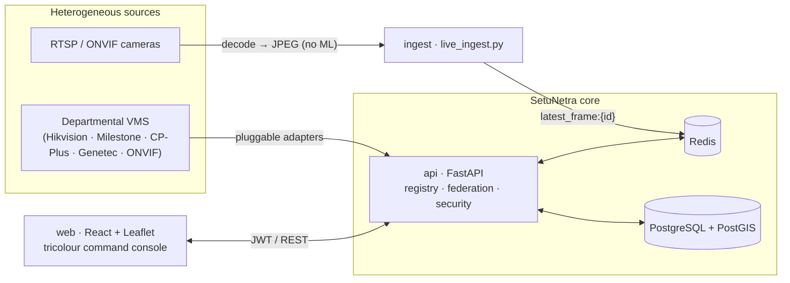

<div align="center">


# SetuNetra — CCTV Command Grid

**Integrated Video Management & Analytics Platform**
Submission for the **Gujarat Police Innovation Challenge 2026** ("Sentinel")

`Model 1 · Registry & GIS` &nbsp;•&nbsp; `Model 2 · Unified Viewing` &nbsp;•&nbsp; `Model 3 · VMS Federation` &nbsp;•&nbsp; `Cybersecurity`

FastAPI · PostgreSQL/PostGIS · Redis · React + Vite + Leaflet · Deterministic (no GPU / no ML)

</div>

---

## 1. The challenge (Step 1)

Across Gujarat, departments — Police, Municipal Corporations, Transport (GSRTC), Panchayats,
Health and others — have each deployed CCTV independently. There is **no centralised way to
identify, map, view or coordinate** these assets. The state vision is a single, secure,
interoperable grid scaling to **~80,000 cameras** across heterogeneous VMS platforms and vendors.

SetuNetra is a **unified command console** that onboards those cameras into one registry, shows
them on one map and one viewing wall, and federates events across vendor systems — **without
ripping out a single existing VMS.**

## 2. Our approach — a Model 1 + 2 + 3 hybrid (Step 2)

The challenge offers four reference models. SetuNetra implements a **hybrid of the first three
plus a cross-cutting cybersecurity layer**:

| Model | Status in SetuNetra |
|-------|---------------------|
| **Model 1 — Registry & GIS Foundation** *(mandatory)* | ✅ Fully implemented |
| **Model 2 — Unified Viewing & Analytics** | ✅ Implemented (viewing + rule-based analytics) |
| **Model 3 — VMS Federation & Middleware** | ✅ Fully implemented |
| **Model 4 — Central VMS & AI Platform** | ⛔ **Out of scope by design** (see below) |

### Deliberate scope decision: deterministic, not AI

This build runs **no AI/ML inference** — no ANPR, no face recognition, no vehicle detection.
Every "analytic" is **deterministic and rule-based**, which makes the platform **CPU-only,
GPU-free, privacy-preserving and fully auditable**:

- **Matching logic** = operator-tagged events + watchlist lookups + a **cross-VMS correlation
  engine** that links the *same entity reported by two or more systems* within a time window.
- Where a source VMS reports its *own* vehicle tags, SetuNetra **aggregates and correlates**
  them — it never claims to have inferred them.

This is a defensible foundation: Models 1–3 and the security architecture are production-shaped
and honest, and **Model 4's AI analytics slot in as a pluggable consumer** of the same event
bus (see [Roadmap](#12-future-roadmap)). Nothing in the data is fabricated — see
[Data & honesty](#13-data--honesty).

## 3. Feature ↔ requirement mapping (Step 3)

**Model 1 — Registry & GIS**

| Brief requirement | Implementation |
|---|---|
| Bulk import, manual entry, API onboarding | `POST /api/onboarding/{bulk,manual}`, CSV import UI, validation |
| Interactive GIS map with dept/type/status layers | Leaflet map (OpenStreetMap, **no API key**), PostGIS points |
| Camera health & maintenance-status monitoring | `camera_health` table, live status from ingest, health endpoint |
| Gap-analysis for uncovered zones / ageing infra | `coverage_gaps` (PostGIS regions) + department/district coverage |
| Role-based search, filter, export, audit trails | Dept-scoped RBAC, filters, CSV export, immutable `audit_log` |

**Model 2 — Unified Viewing & Analytics**

| Brief requirement | Implementation |
|---|---|
| Feed aggregation (RTSP/ONVIF) | CPU-light `live_ingest` (RTSP → JPEG → Redis), unified wall |
| Event tagging & camera-wise indexing | `camera_events`, operator tagging, searchable index |
| Searchable vehicle-movement records | Event index by camera / label / type; watchlist links |
| Configurable multi-camera grid / video wall | Responsive viewing wall with live status per tile |
| Alerts for tagged events & vehicles of interest | Rule-based `alerts` (offline, tamper, watchlist-hit, correlation) |

**Model 3 — VMS Federation & Middleware**

| Brief requirement | Implementation |
|---|---|
| Adapter/plugin architecture for multiple vendors | `api/app/adapters/` — Hikvision, Milestone, CP-Plus, Genetec, ONVIF |
| Metadata exchange bus | `federated_events` ingested per adapter via a common interface |
| Cross-system event-correlation engine | Deterministic same-entity/time-window correlation on sync |
| Unified workflow & alert dashboard | Federation console: systems, events, correlations, analytics |
| Extensible connector framework | One `@register("<type>")` class onboards a new vendor |

## 4. Architecture



- **`ingest`** decodes each camera's `rtsp_url` to a periodic JPEG in Redis. No inference — a
  single frame every few seconds keeps it CPU-cheap.
- **`api`** owns the registry, RBAC/JWT auth, the federation adapters + correlation engine, the
  rule-based alerting and the security surfaces.
- **`web`** is the light, tricolour, emblem-branded command console.
- **PostgreSQL + PostGIS** is the system of record; **Redis** carries live frames and the bus.

## 5. Tech stack

| Layer | Choice |
|---|---|
| Backend | Python 3.11, FastAPI, SQLAlchemy (raw SQL for hot paths) |
| Database | PostgreSQL 16 + **PostGIS** (geometry, GIST indexes) |
| Cache / bus | Redis 7 |
| Ingest | OpenCV (FFmpeg backend) — **no GPU, no ML libraries** |
| Frontend | React 18, Vite, react-leaflet, OpenStreetMap tiles |
| Auth | Stateless **JWT (HS256)**, bcrypt via `pgcrypto` |

## 6. Quick start

Requires Docker and (for local dev) Python 3.11 + Node 18+.

```bash
cp .env.example .env

# Option A — everything in containers
docker compose up -d --build
# → console at http://localhost:5173 , API at http://localhost:8000

# Option B — infra in Docker, app on host (used during development)
docker compose up -d db redis          # Postgres+PostGIS (auto-seeded) + Redis
cd api  && pip install -r requirements.txt && uvicorn app.main:app --port 8000
cd web  && npm install && npm run dev
```

The database **auto-seeds** on first run (`contracts/schema.sql` then `contracts/seed.sql`):
30 real catalogue cameras across 10 districts and 5 departments, 5 demo users, watchlist,
VMS systems, federated events and alerts.

### Demo accounts

| Email | Password | Role | Sees |
|---|---|---|---|
| `admin@setunetra.gov.in` | `Admin@123` | State Administrator | Everything |
| `police@setunetra.gov.in` | `Police@123` | Dept Officer | Police cameras only |
| `rajkot@setunetra.gov.in` | `Station@123` | Station Officer | Own district |
| `auditor@setunetra.gov.in` | `Audit@123` | Auditor | Security + audit |
| `viewer@setunetra.gov.in` | `Viewer@123` | Control-room viewer | Read-only ops |

> Demo passwords for a local database only. Real secrets (`API_SECRET_KEY`, DB/Redis
> credentials) are environment-only and never committed.

## 7. Live camera ingest (Step 4 feeds)

`ingest/src/live_ingest.py` reads every camera's `rtsp_url` from the registry, decodes one frame
every `INGEST_INTERVAL` seconds with OpenCV, publishes a small JPEG to `latest_frame:{id}` in
Redis, and writes **truthful** online/offline status back to the registry. It is bounded and
CPU-light by design.

```bash
cd ingest && pip install -r requirements.txt

# Ingest all registered feeds (run where the camera network is reachable)
python src/live_ingest.py

# Verify the pipeline with a local sample file mapped to a camera id
INGEST_ONLY_LOCAL=1 INGEST_LOCAL_SOURCES="5=/path/to/sample.mp4" python src/live_ingest.py
```

Unreachable feeds are shown **honestly as offline** — frames are never fabricated. Point the
service at the hackathon portal's feeds (or a local network that can reach them) and the wall
lights up live.

## 8. Data model (key tables)

`departments` · `stations` · `users` (RBAC) · **`cameras`** (PostGIS point, dept, type, tiers,
status, `rtsp_url`) · `camera_health` · `coverage_gaps` (PostGIS regions) · `watchlist`
(vehicles / persons of interest) · `camera_events` (operator/rule tags) · **`vms_systems`** ·
**`federated_events`** · **`event_correlations`** · `alerts` (rule-based) · `audit_log` ·
`security_events` · `external_lookups` (mock VAHAN/Sarthi adapters).

## 9. API overview

| Group | Endpoints |
|---|---|
| Auth | `POST /api/auth/login`, `GET /api/auth/me` |
| Registry (M1) | `GET /api/cameras`, `GET/DELETE /api/cameras/{id}`, `GET /api/cameras/health`, `GET /api/cameras/{id}/snapshot` |
| Onboarding (M1) | `POST /api/onboarding/{manual,bulk,validate}`, `GET /api/onboarding/template` |
| Coverage (M1) | `GET /api/coverage/gaps` |
| Viewing (M2) | `GET/POST /api/camera-events`, `GET /api/watchlist`, `GET/PATCH /api/alerts` |
| Federation (M3) | `GET /api/vms`, `GET /api/vms/events`, `GET /api/vms/correlations`, `GET /api/vms/analytics`, `POST /api/vms/{id}/sync` |
| Security | `GET /api/security/posture`, `GET /api/security/events`, `GET /api/audit/logs` |
| Dashboard | `GET /api/stats` |

## 10. Cybersecurity architecture (Step 3 deliverable)

- **Authentication** — stateless JWT (HS256, 8h TTL); passwords bcrypt-hashed in Postgres via
  `pgcrypto`, verified in-DB.
- **Authorisation** — 5-role, department-scoped RBAC enforced server-side on every route.
- **Brute-force defence** — account lockout after 5 failed attempts / 15 minutes.
- **Rate limiting** — per-IP sliding window (media polling exempt).
- **Transport/headers** — CSP, HSTS, X-Frame-Options, X-Content-Type-Options, Referrer-Policy.
- **Auditability** — immutable `audit_log` on every mutation; `security_events` telemetry
  (failed logins, lockouts, RBAC denials, anomalies) surfaced on a live **posture dashboard**.
- **Secrets** — environment-only; nothing sensitive committed.

## 11. Scaling to ~80,000 cameras (Step 6)

- **Ingest** — the frame-grab worker is horizontally shardable by camera range; one modest CPU
  node handles hundreds of low-FPS snapshot feeds, so scale is linear in nodes, **no GPU fleet**.
- **Network / bandwidth** — snapshot polling (not full-motion relay) keeps per-camera bandwidth
  tiny; full-motion viewing is on-demand and edge-local.
- **Storage / retention** — per-camera `storage_tier` (hot/warm/cold) + retention policy drives
  tiered object storage; the registry stores metadata, not video.
- **Datastore** — PostgreSQL partitioning + read replicas; Redis Cluster for the bus/frames.
- **AI processing capacity** — deferred by design; Model 4 analytics attach as independent GPU
  workers consuming the Redis frame keys, scaled separately from the control plane.
- **Disaster recovery** — stateless API replicas behind a load balancer; DB PITR + streaming
  replication; adapters reconnect idempotently.
- **Rollout** — department-by-department onboarding via the same registry + adapter framework.

## 12. Future roadmap

- **Model 4 AI layer** as a pluggable consumer of `latest_frame:{id}` (ANPR / vehicle / face),
  writing back into the *same* `alerts` + `event_correlations` tables — the UI needs no change.
- WebRTC/HLS low-latency full-motion viewing alongside snapshots.
- Live adapter connectors for real vendor SDKs (the mock adapters define the interface).
- Real government DB integration (VAHAN/Sarthi) behind the existing `external_lookups` shell.

## 13. Data & honesty

Representative dataset, **no fabricated facts**:

- **Real** — camera device IDs and location names are from the hackathon catalogue.
- **Estimates (labelled)** — coordinates/district are geocoded estimates of the real place names.
- **Operational classifications** — department, camera type and storage tiers are assigned.
- **Deliberately blank** — device specifics the catalogue does not provide (make, model, IP,
  FPS, resolution) are left **NULL**, never invented.
- **Live** — camera online/offline status comes from real ingest results, not seeded values.

## 14. Repository layout

```
api/        FastAPI backend — routers, adapters, auth, middleware
web/        React + Vite console (tricolour theme, emblem, Leaflet)
ingest/     CPU-light RTSP→JPEG ingest (no ML)  ·  src/live_ingest.py
contracts/  schema.sql (canonical schema) + seed.sql (demo dataset)
docker-compose.yml
```

---

<div align="center">
Prototype for the Gujarat Police Innovation Challenge 2026 · For evaluation use.
</div>
