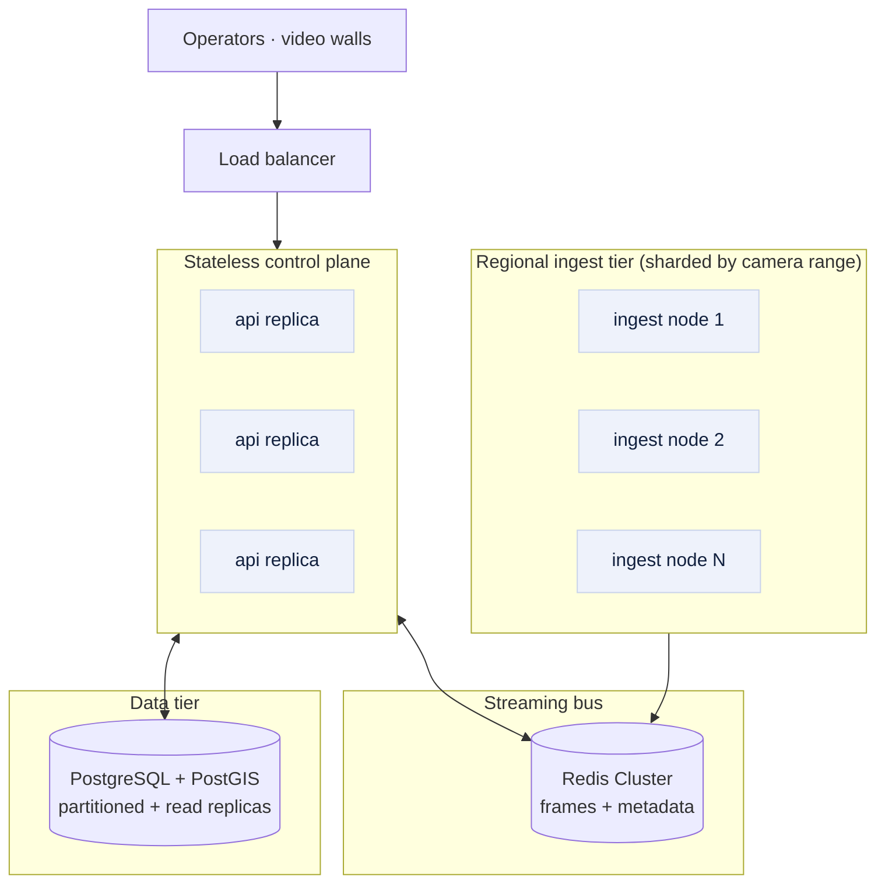

# SetuNetra — Scalability Strategy

**Scaling securely and reliably to ~80,000 cameras across Gujarat**
Gujarat Police Innovation Challenge 2026 · Step 6 deliverable

---

## 1. Why SetuNetra scales cheaply

Three architectural choices make statewide scale affordable, and they are true of
the code as built today:

1. **The registry stores metadata, not video.** Every camera is ~1 KB of rows.
   80,000 cameras is a few tens of MB — the control plane never touches the video
   bitstream, so it scales like any ordinary web application.
2. **Viewing is snapshot-first, not a full-motion relay.** The ingest pulls a small
   JPEG (~40 KB) on a cadence and only opens full-motion for the handful of cameras
   an operator is actively watching. Bandwidth is therefore driven by *what is being
   watched*, not by the total camera count.
3. **No GPU, no ML in the critical path.** All analytics are deterministic and
   rule-based, so ingest and correlation scale **linearly on commodity CPU** — you
   add nodes, not GPUs. (AI is an *optional* future layer that scales separately —
   see §5.)

> No existing departmental VMS is replaced. SetuNetra federates and adds a control
> plane on top, so scale is additive, not a forklift migration.

## 2. Horizontal architecture at scale

Every tier scales independently and horizontally:

| Tier | Scaling model |
|---|---|
| **Ingest** | Stateless workers, sharded by camera-id range. Add nodes to add capacity. |
| **Bus (Redis)** | Redis Cluster; frames are short-TTL keys, partitioned by camera id. |
| **API / control plane** | Stateless replicas behind a load balancer; scale on request load. |
| **Database** | PostgreSQL partitioning (by time/region) + read replicas for query fan-out. |

## 3. Infrastructure sizing (honest engineering estimates)

Assumes health/registry snapshotting of all cameras + full-motion only for actively
watched feeds. Figures are order-of-magnitude planning numbers, not benchmarks.

| Dimension | Per camera | × 80,000 | Notes |
|---|---|---|---|
| Registry metadata | ~1 KB | ~80 MB | Trivial; fits in RAM. |
| Health snapshot (1 frame / 60 s) | ~40 KB / 60 s | **~425 Mbps** aggregate | Spread across regional ingest nodes. |
| Ingest concurrency | — | rotating pool per node | e.g. 500 cams/node in rotation → **~160 ingest nodes** |
| Events / alerts / audit | ~a few rows/day | partitioned, TTL'd | Time-partitioned tables + cold archive. |
| Full-motion viewing | ~2–4 Mbps | only for watched cams | A 64-camera video wall ≈ 128–256 Mbps, edge-local. |

**Compute:** ingest is I/O-bound at snapshot cadence; a modest 8-core node comfortably
rotates several hundred cameras. Control-plane and database sizing follow standard
web-app capacity planning (CPU/req and rows/query), not video throughput.

## 4. Network & bandwidth planning

- **Regionalise ingest.** Place ingest nodes close to each district's cameras so
  RTSP/TCP stays on regional links; only compact JPEGs + metadata cross the WAN.
- **Snapshot for health, stream for viewing.** Statewide health monitoring is
  snapshot-based (KB, not Mbps). Full-motion is on-demand and terminates at the
  nearest edge, so the core network carries control traffic, not 80,000 video feeds.
- **Force TCP, back off on reconnect.** The ingest already forces `rtsp_transport=tcp`
  and reconnects with exponential backoff, and **respects per-source concurrency
  limits** (bounded pool) so it never stampedes a gateway.

## 5. AI processing capacity (optional future layer)

The platform is deliberately GPU-free today. When AI analytics (ANPR, vehicle/face,
Model 4) are wanted, they attach as **independent workers that consume the frames the
ingest already publishes** and write results back into the *same* `alerts` and
`event_correlations` tables — the UI and data model need no change.

- **Sizing:** ~1 modern GPU per ~30–50 concurrent ANPR streams (workload-dependent).
- **Placement:** run AI only where/when needed (e.g., ANPR on highway-ingress cameras),
  not on all 80,000 — analytics scale to the *task*, not the fleet.
- **Isolation:** the AI tier is separate from the control plane, so a GPU shortage
  never affects registry, viewing or federation.

## 6. Storage & retention strategy

- **Central store holds metadata, events and evidence snapshots — not bulk video.**
  Bulk recording stays in departmental VMS/edge storage (Model 3 federates it).
- **Per-camera tiering** (`hot` / `warm` / `cold`) + retention policy already model
  storage class in the registry; drive tiered object storage from it.
- **Time-partition** `camera_events`, `alerts`, `audit_log`, `security_events`; roll
  old partitions to cold archive; keep audit immutable and long-lived.

## 7. Disaster recovery

- **Stateless API replicas** behind a load balancer — lose a node, lose nothing.
- **PostgreSQL**: streaming replication + Point-In-Time Recovery; a warm regional
  standby for failover.
- **Redis**: cluster with replicas; frames are ephemeral (short TTL) so loss is
  self-healing on the next ingest cycle.
- **Idempotent adapters & ingest**: reconnect and resync cleanly after any outage;
  no manual repair.

## 8. Statewide rollout plan

1. **Foundation** — deploy the registry + GIS; bulk-import each department's camera
   inventory (Model 1). Immediate statewide *visibility* with zero streaming risk.
2. **Federate** — onboard each departmental VMS via a vendor adapter (Model 3); no
   rip-and-replace, existing systems keep running.
3. **Unify viewing** — enable the viewing wall region-by-region as ingest nodes are
   provisioned (Model 2).
4. **Harden & scale** — regional read replicas, Redis Cluster, DR standby; add the
   optional AI tier where the workload justifies it.
5. **Operate** — coverage-gap analysis guides where to add cameras next, closing the
   loop from visibility to investment.

---

Prototype for the Gujarat Police Innovation Challenge 2026 · For evaluation use.

